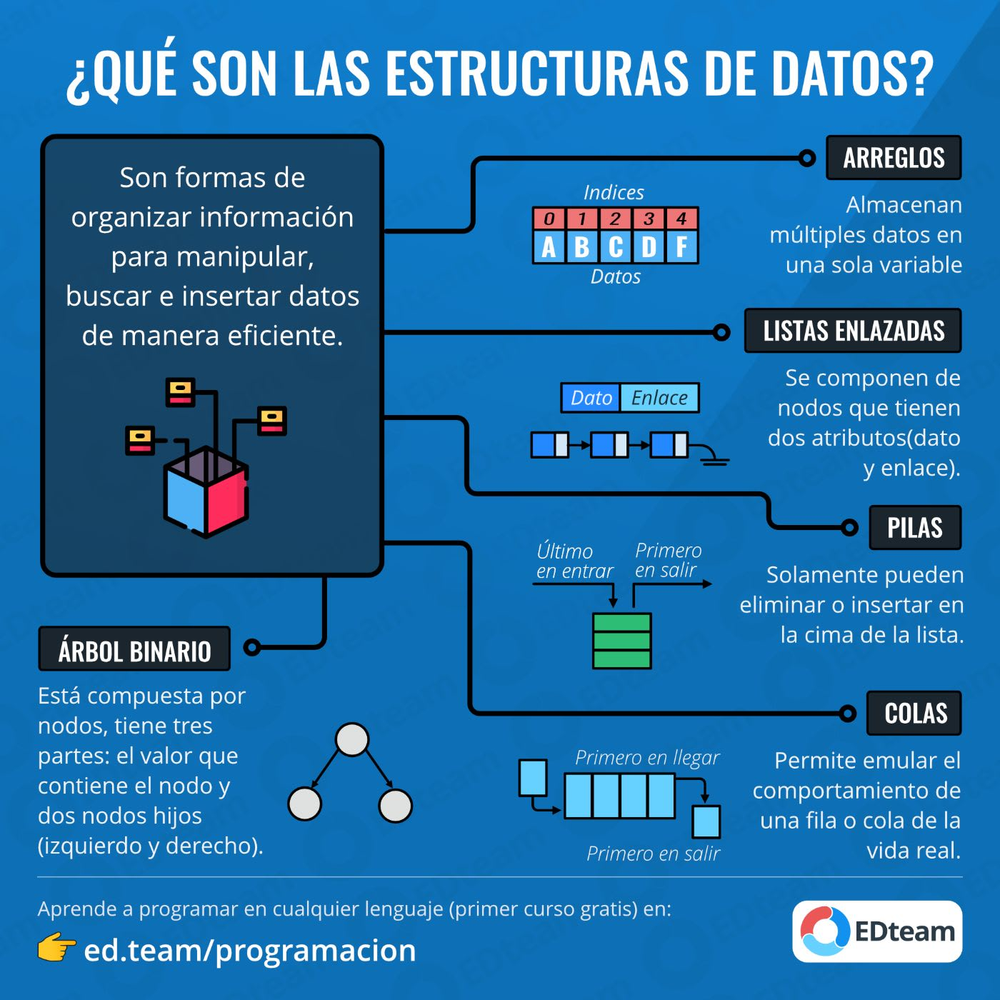

# Estructura de Datos

En este ´repositorio´ podras encontrar temas relcionados con  estructuras de datos implementadas en JAVA como:
1. Tipos de datos abstractos 
2. recursividad 
3. Arreglos
4. Genericos
5. Listas
6. Pilas
7. Colas
8. Metodos de ordenamiento y busqueda
9. Arboles

